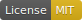
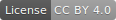

# Blog

Many thanks to Atte Juvonen for his blog template [https://www.attejuvonen.fi](https://www.attejuvonen.fi).

## Notes

`static/preview.jpg` is the social network preview for the blog link. Recommended aspect ratio is 1.91.

Posts with a date prefix (`2020-03-05--my-blog-post`) are published. Posts without a date prefix (`my-blog-post`) are drafts.

Content images (`content/posts/*/*.jpg`) must be of 2.222 aspect ratio.

## Personalize steps (todo)

1. Build and run locally and commit
2. "Hero" section at the top of the home page (now set `hero.hide` to `false` in `theme.yaml`).
3. Move your own icons into `src/images/app-icons`, run `npm run generate-app-icons`, then replace `static/favicon.ico`.
4. Contact page. Remove it or [Setup Contact Form submission via Google Script](https://github.com/dwyl/learn-to-send-email-via-google-script-html-no-server). You need to add the POST address to environment variable `CONTACT_POST_ADDRESS`.
5. E-mail newsletter link on the `Follow` page. Remove it or set up a newsletter and add the URL as an environment variable `EMAIL_SUB_LINK`.

## Planned improvements (todo)

1. Google Analytics: add `GOOGLE_ANALYTICS_ID=123456` to environment variables.
2. Search page: [follow instructions](https://dev.greglobinski.com/setup-algolia-account/) uncomment code by 'algolia'.
3. Migrate to TypeScript
